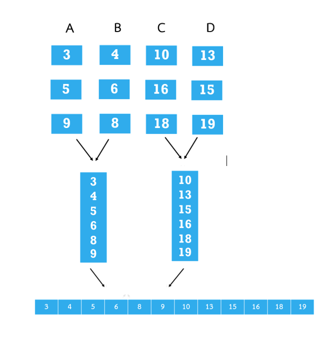

# Report-External-Sorted


# External Sort
<p>
	การเรียงลำดับภายนอก คือ อัลกอรึธึมการเรียงลำดับที่สามารถจัดการข้อมูล จำนวนมหาศาลได้ เมื่อข้อมูลจัดเรียงไม่พอดี (fit) กับหน่วยความจำหลักของคอมพิวเตอร์ (RAM) และจะต้องอยู่ในหน่วยความจำภายนอกที่ช้ากว่า (Hard drive) แทน
	การเรียงลำดับภายนอกมักใช้อัลกอริทึมแบบไฮบริดในการเรียงลำดับส่วนของข้อมูล ที่มีขนาดเล็ก ข้อมูลจะถูกใส่ลงในหน่วยความจำหลัก จะถูกอ่าน จัดเรียง และเขียนลงในไฟล์ชั่วคราว 
ซึ่งในขั้นตอนการรวมไฟล์ย่อยที่เรียงลำดับจะถูกรวมเป็นไฟล์ใหญ่ไฟล์เดียว
Natural merge sort
</p>

## การเรียงลำดับแบบผสาน (Merge sort)

<p>
“แบ่งรายการที่ไม่เรียงลำดับออกเป็น n รายการย่อย โดยแต่ละรายการมีองค์ประกอบหนึ่งรายการ ซึ่งรายการขององค์ประกอบหนึ่งรายการจะถือเป็นการจัดเรียง รวมรายการย่อยซ้ำๆ เพื่อสร้างรายการย่อยที่เรียงลำดับใหม่จนกว่าจะมีรายการย่อยเหลือเพียงรายการเดียว”
กล่าวคือ รายการเรียงลำดับ merge sort จะเป็นลักษณะ การตัด array ออกเป็น 2 ส่วนในแต่ละส่วนก็จะเอาไป recursion ตัดออกเป็นชิ้นย่อย ๆ ลงไปอีกจนเหลือขนาดเล็ก ที่สามารถ sort ได้ ก็จะจัดการ sort ชิ้นเล็กๆ ให้เสร็จแล้วค่อยนำชิ้นเล็กๆ ที่ sort เสร็จมาต่อกันอีกที
การที่จะนำมาต่อกัน เราจะใช้การวนซ้ำ ซึ่งจะใช้วิธีใดก็ได้ ในที่นี้เราจะใช้ while loop ทำการวนซ้ำ จนกว่าข้อมูล จะหมด โดยแต่ละรอบให้ทำการเช็คว่า ตำแหน่งแรกของ array ย่อย 2 ตัวอันไหนที่น้อยกว่า ให้ใส่ใน array ใหญ่
</p>


<p>
จะเห็นได้ว่า merge sort จะเป็นอัลกอริทึมในลักษณะ recursion และ ใช้หลักการแบ่ง (divide & conquer) ซึ่ง Divide and Conquer เป็นวิธีการแก้ปัญหาแบบเรียกซ้ำ ซึ่งแบ่งปัญหาออกเป็นปัญหาย่อยที่มีขนาดเล็กลง แก้ปัญหาย่อยแบบเรียกซ้ำ และสุดท้ายรวมการแก้ปัญหาย่อยเพื่อแก้ปัญหาเดิม วิธีนี้มักจะช่วยให้เราลดความซับซ้อนของเวลาได้มาก
</p>


```
1.Algorithm merge sort (low, height)
2.	if (low <pre heigh):
3.		mid = (low + height)/2 
4.		merge sort(low, mid)
5.		merge sort(mid + 1, height)
6.		merge (low, mid, height)
7.end

```

### ภาพเพิ่มเติมสำหรับ Merge sort
กระบวนการแยก

- ref: https://www.happycoders.eu/wp-content/uploads/2020/07/mergesort_algorithm_divide-v2-800x447.png

กระบวนการ merge
 

- ref: https://www.happycoders.eu/wp-content/uploads/2020/07/mergesort_algorithm_merge-v2-800x416.png

ภาพรวม

 

- ref: https://th.wikipedia.org/wiki/%E0%B9%84%E0%B8%9F%E0%B8%A5%E0%B9%8C:Merge_sort_algorithm_diagram.svg


### การ Merge ลิสต์ที่เรียงลำดับแล้วสองลิสต์ รวมกันเป็น ลิสต์เรียงลำดับ ลิสต์ดียว 
(two sorted list merge to single sorted list)


 
 &nbsp;&nbsp;&nbsp;&nbsp;&nbsp;&nbsp;&nbsp;
 

<br>
<br>
<br>

 


## Balanced merge sort
<p>
การเรียงลำดับการผสาน k-way แบบสมดุลที่จัดเรียงสตรีมข้อมูลโดยใช้การผสานซ้ำๆ มันกระจายอินพุตออกเป็นสองสตรีมโดยอ่านบล็อกอินพุตที่พอดีกับหน่วยความจำซ้ำๆ รัน เรียงลำดับ แล้วเขียนไปยังสตรีมถัดไป จากนั้นจะผสานสองสตรีมซ้ำๆ และทำให้แต่ละรันที่ผสานเข้าเป็นหนึ่งในสองเอาต์พุตสตรีม จนกว่าจะมีเอาต์พุตที่จัดเรียงเพียงรายการเดียว
</p>

<p>
ยกตัวอย่าง แม้ว่าดิสก์ไดร์ฟส่วนใหญ่สามารถทำงานกับไฟล์ชั่วคราวจำนวนมากได้แต่ก็ใช้ไม่ได้กับพื้นที่จัดเก็บเทป ซึ่งเป็นเรื่องยากที่จะมีไฟล์หลายไฟล์ในเทปเดียว และเรามีเทปไดร์ฟในจำนวนจำกัดเราสามารถทำได้ด้วย 3 หรือ 4 เทป แต่เราสามารถเพิ่มประสิทธิภาพได้ด้วยเทปไดร์ฟมากขึ้น
</p>

### ตัวอย่าง 4-way merge
 



### Iterative 2-way merge 

การผสาน 2 ทางแบบวนซ้ำ เป็นการผสานอาร์เรย์ k สองชุดซ้ำๆ โดยใช้การผสานแบบ 2 ทางจนเหลือเพียงอาร์เรย์เดียว หากอาร์เรย์ถูกรวมในลำดับที่ต้องการ เวลาทำงานที่ได้จะเป็น O(kn) เวลาทำงานสามารถปรับปรุงได้โดยการรวมครั้งแรกกับครั้งที่สอง ครั้งที่สามกับครั้งที่สี่ และอื่นๆ
เนื่องจาก จำนวนอาร์เรย์ลดลงครึ่งหนึ่งในการวนซ้ำแต่ละครั้ง ทุกองค์ประกอบจะถูกย้ายเพียงครั้งเดียว เวลาทำงานต่อการวนซ้ำจึงอยู่ใน Θ(n) เนื่องจาก n คือจำนวนขององค์ประกอบ เวลาทำงานทั้งหมดจึงเป็น Θ(n log k)
 
Polyphase merge
	การเรียงลำดับแบบผสานเฟสเป็นรูปแบบของการเรียงลำดับการผสานจากล่างขึ้นบน ที่เรียงลำดับรายการโดยใช้การกระจาย รายการย่อย (runs) ที่ไม่สม่ำเสมอ
ซึ่งส่วนใหญ่ใช้สำหรับการเรียงลำดับภายนอกและมีประสิทธิภาพมากกว่าการเรียงลำดับ ผสานทั่วไปเมื่อมีน้อยกว่า 8 ไฟล์การทำงานภายนอก (เช่น เทปไดร์ฟหรือไฟล์บนฮาร์ดไดร์ฟ) การเรียงลำดับการรวมหลายเฟสไม่ใช่การเรียงลำดับที่เสถียร 
กล่าวคือ การเรียงลำดับแบบ polyphase merge จะลดจำนวนการรัน (runs) ทุกครั้งที่วนซ้ำของลูปหลักโดยการรวมรัน(runs) เป็นรัน(runs) ที่ใหญ่ขึ้น ซึ่งเป็นการรวมกันของสองเทคนิคคือ balanced two-way และ multi-way merging

### Polyphase merge example

สมมุติว่าเรามี 3 เทป  (T1, T2, T3 ) และเราจะ merge ตามลำดับดังนี้ 
จัดเรียงและแจกจ่ายบันทึกไปยัง T1 และ T2
Merge T1 และ T2 ไปยัง T3 เหลือไว้บางตัวใน T2
Merge T2 และ T3 ไปยัง T1 เหลือไว้บางตัวใน T2
Merge T3 และ T1 ไปยัง T2 เหลือไว้บางตัวใน T3
Merge T1 และ T2 ไปยัง T3 เหลือไว้บางตัวใน T2 และอื่นๆ
เรามักทิ้งเทปต้นฉบับไว้สองอันและเทปหนึ่งอันสำหรับวางไฟล์ที่ผสาน
 
 


## อ้างอิง

 Aman Chauhan 1(2560) .  polyphase merge sort. ค้นคืนแล้ว 29 กันยายน 2564 แหล่งที่มา https://practice.geeksforgeeks.org/problems/explain-poly-way-merge-sort

CSC 344 – Algorithms and Complexity. Lecture #4 – External Sorting. ค้นคืนแล้ว 29 กันยายน 2564. แหล่งที่มา https://home.adelphi.edu/~siegfried/cs344/344l4.pdf

GeeksforGeeks(2564). Merge Sort. ค้นคืนแล้ว 28 กันยายน 2564. แหล่งที่มา https://www.geeksforgeeks.org/merge-sort/

GeeksforGeeks(2564). External Sorting. ค้นคืนแล้ว 27 กันยากัน 2564. แหล่งที่มา  https://www.geeksforgeeks.org/external-sorting/

Minsoo Jeon and Dongseung Kim. Load-Balanced Parallel Merge Sort. 
ค้นคืนแล้ว 29 กันยายน 2564. แหล่งที่มา https://www.researchgate.net/publication/220091378_Parallel_Merge_Sort_with_Load_Balancing#pf4

Son-klin Limthongkul(2557). External sorting. ค้นคืนแล้ว 28 กันยากัน 2564. แหล่งที่มา https://slideplayer.in.th/slide/2180294/

Sven Woltmann(2563). Merge Sort – Algorithm, Source Code, Time Complexity. 
ค้นคืนแล้ว 28 กันยายน 2564. แหล่งที่มา
https://www.happycoders.eu/algorithms/merge-sort/#Natural_Merge_Sort

Ta(2012). [ชีทสรุป พี่ต้า] Data Structure & Algorithm. Merge Sort. ค้นคืนแล้ว 28 กันยายน 2564. แหล่งที่มา https://docs.google.com/file/d/0B09a_TYwhKDZZXNSRHV3aFhuamc/edit?resourcekey=0-JzOfoiKxvZreJUR5U0vPYg

Wikipedia(2564). Merge sort. ค้นคืนแล้ว 27 กันยายน 2564. แหล่งที่มา https://en.wikipedia.org/wiki/Merge_sort

Wikipedia(2564).Two-way_merge. ค้นคืนแล้ว 29 กันยายน 2564 	
แหล่งที่มา https://en.wikipedia.org/wiki/K-way_merge_algorithm#Two-way_merge

Wikipedia(2021). Polyphase merge sort. ค้นคืนแล้ว 29 กันยายน 2564. แหล่งที่มา https://en.wikipedia.org/wiki/Polyphase_merge_sort

